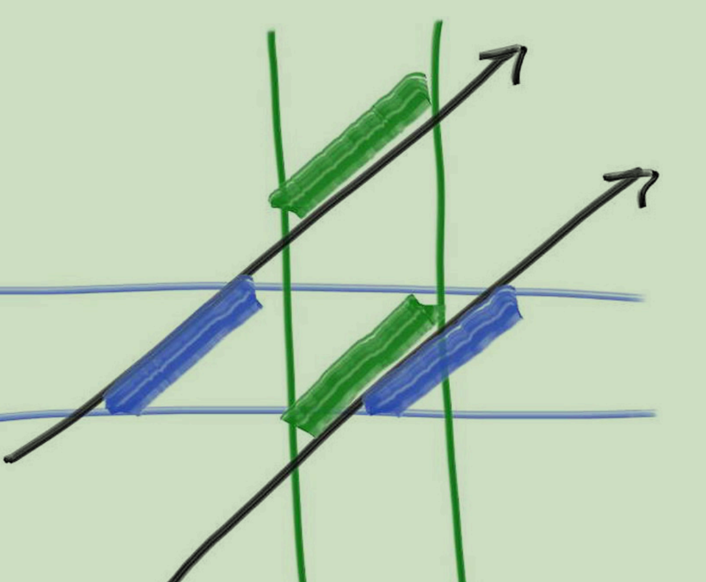
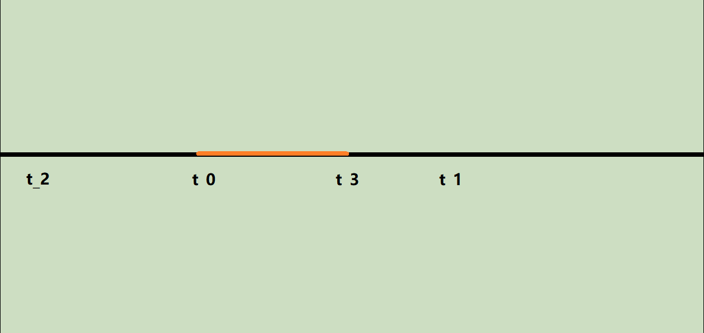

# Ray Tracing in next week

# 一、Motion Blur (Spacing time rendering)

时空渲染对应于相机的快门以及运动物体。在单帧的渲染中设定起始时间为0，结束时间为1，将物体的中心位置在时间维度进行插值得到运动位置

# 二、BVH（Bounding volume hierarchy）

## 1. BVH的主要作用

通过将场景中的物体的空间位置进行划分形成包围体（包围盒）的形式进行组织，降低光线查询时间从暴力计算的O(N)（N为图形原语的个数）到O(logn)，提升光追时的性能

## 2. BVH相交计算

BVH主要通过使用AABB盒的方式进行子树递归划分，最终形成整体的包围数，并且不要求左右子树的顺序，毕竟BVH的主要目的就是为了快速计算是否击中，而不是其他目的

通过这张图的观察可知，光线有这样集中情况：

- 和坐标轴平行
- 和包围框的延展区域相交，如果一条光线只是和包围框的延展区域相交那么两者在两个轴上的相交部分都不会出现重叠
- 和包围框本身相交，如果一条光线和包围框本身相交则会出现在两个轴上出现区域重叠

将光线参数化 $P(t) = Q + t * d$, 其中$t$为motion blur中的时间参数，在和轴相交时会出现两个交点$P_{axis}(t_0)$和$P_{axis}(t_1)$，在2D中如果光线在包围框内出现了相交，那么体现在轴上表现为出现区域重叠，而体现在参数化后的时间参数$t$上则是时间范围内出现重叠。

如上图所示将蓝色的轴作为x轴，绿色的轴作为y轴，将和包围框相交的光线与x轴相交的两个点的时间记为$t_0$, $t_1$,与y轴相交的两个点的时间即为$t_2$, $t_3$,将这三个时间绘制到时间轴上

同样可以将不和包围框（与包围框的延展线）相交的部分绘制到一维数轴上会发现时间上并没有重叠的部分。

## 3. BVH的构造方式

BVH的构造方式包含很多方式，在教程中介绍了两种：基于随机轴划分的方式和基于长轴划分的方式

### 3.1 基于随机轴划分的方式

### 3.2 基于长轴划分的方式

