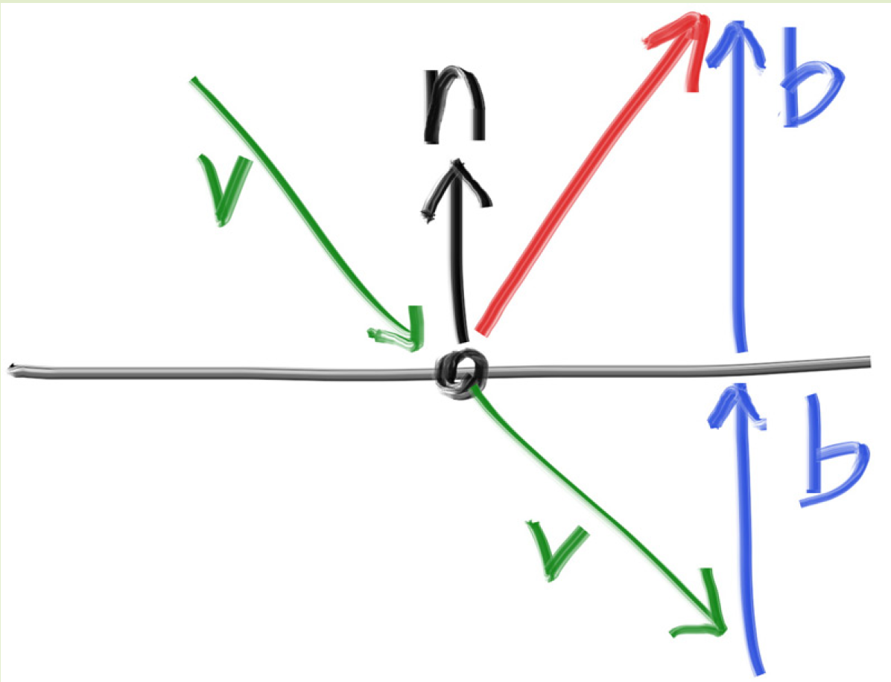

# Lambertian Reflection（理想漫反射）
1. 核心思想：一个理想的朗伯表面，会将所有入射光（无论来自哪个方向）完全均匀地（或按余弦规律）反射到法线所指向的整个半球空间
2. lambertian reflection就对应于漫反射，并不是漫反射的一种技术，而是就是漫反射本身，又被称之为理想漫反射
3. 实现方法
```c++
// 在以 N 为轴的单位半球内随机生成一个方向，即在单位法线的末端为圆心，单位向量为半径的球上随机散射
vec3 direction = random_on_hemisphere(rec.normal); 

// 创建从交点 rec.p 出发，沿此方向的新光线
ray scattered = ray(rec.p, direction);

// 递归追踪这条新光线
return attenuation * ray_color(scattered, depth-1, world);
```

# 镜面反射
1. 与lambertian reflection的区别就是这种不再是随机在单元球中漫反射了，而是入射光线和出射光线关于法线对称
2. 实现方法

```c++
inline vec3 reflect (const vec3& v, const vec3& n)
{
return v - 2 * dot(v,n)*n;
}
```
其中$n$为单位向量，`dot(v,n)`为v在n方向上的投影长度，乘上$n$为在$n$上的投影向量，乘上-2即为图上的`2b`，再加上v记得反射方向

# fuzzy reflection
1. 在镜面反射的基础上再做一次fuzzy，当fuzzy为0时即为镜面反射，当fuzzy为1时就非常接近lambertian reflection
2. 实现

```c++
vec3 R = reflect(r.direction(), rec.normal); // 理想镜面反射方向
vec3 fuzz = random_in_unit_sphere() * fuzziness; // fuzziness 控制模糊程度
vec3 direction = R + fuzz; // 扰动反射方向
ray scattered = ray(rec.p, direction);
```
但是要注意，因为这是在击中物体后需要再做一次fuzzy，所以需要防止出现指向物体内部的现象出现，所以还需要检查最终散射向量和法向之间的关系，如果和法向方向一致则通过，否则不通过

# Dielectrics（介质反射）