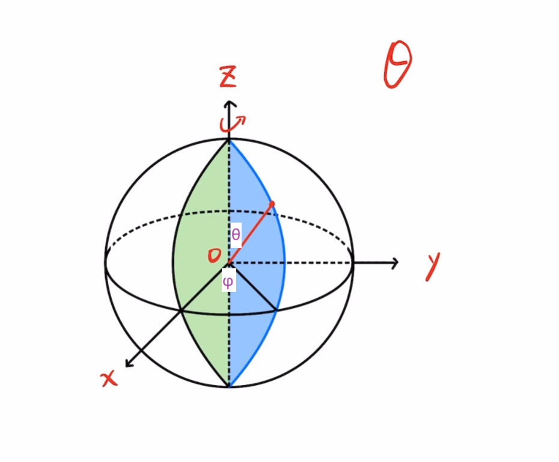
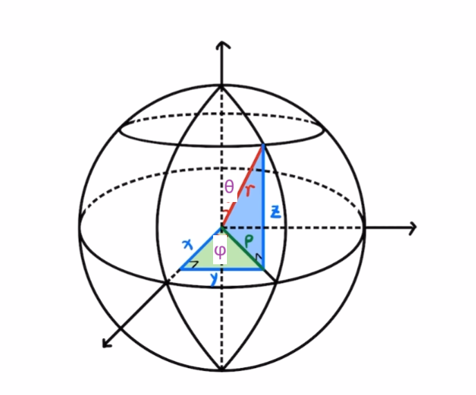

# 球坐标
## 1. 球坐标系
球坐标的三个参数为($r$, $\theta$, $\phi$)
- r为球的半径
- $\phi$为沿着xoz平面的切面绕着轴逆时针旋转的角度
- $\theta$为绕着切面上的线段绕着y轴顺时针旋转的角度

## 2. 球坐标和直角坐标系转换

1. 球坐标系转直角坐标系
$$
\begin{aligned}
x &= r \times sin\theta cos\phi \\
y &= r \times sin\theta sin\phi \\
z &= r \times cos\theta
\end{aligned}
$$

2. 直角坐标系转球坐标系

$$
\begin{aligned}
r &= \sqrt{x^2 + y^2 + z^2} \\
\theta &= arccos(\frac{z}{r}) \\
\phi &= arctan(y, x)
\end{aligned}
$$

